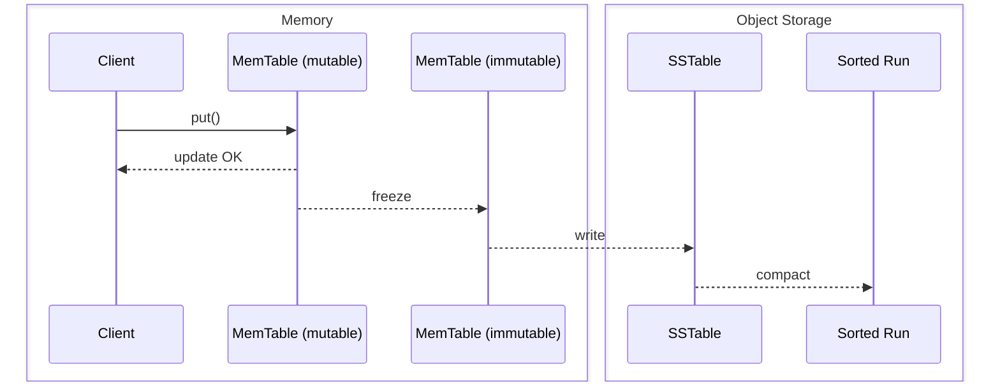
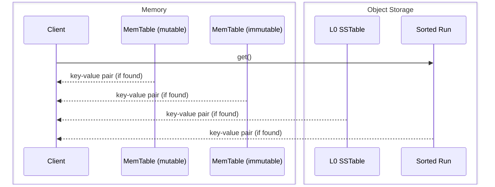

# SlateDB Notes

Source: https://materializedview.io/p/cloud-storage-triad-latency-cost-durability

## Thesis

Object stores are converging on low latency reads and writes with atomicity.

PUTs cost $0.005 per 1k requests.
At 10k requests/second, that is ~$130k/month.
Batching writes to every 10ms caps at 100 requests/second, dropping cost to ~$1,300/month.
This creates a three-way trade-off between cost, latency, and durability.
Think CAP for object store writes: cost/latency/durability ([source](https://x.com/criccomini/status/1781356213764321768)).

|               | cost | latency | durability |
|---------------|------|---------|------------|
| sync          | HIGH | HIGH    | HIGH       |
| sync batch    | HIGH | LOW     | HIGH       |
| async batch   | LOW  | LOW     | LOW        |

Reduce API costs by batching.
Clients can wait (durability) or not (latency).

SlateDB addresses this by writing everything (including the WAL) to object storage while caching recent writes in memory.

## API

- `put(key, value)` -- insert a key-value pair
- `get(key)` -- retrieve a key-value pair
- `delete(key)` -- delete a key-value pair
- `scan(range)` -- scan a range of keys
- `flush()` -- flush in-memory data to object storage

Keys are limited to 65 KiB.
Values are limited to 4 GiB.

## Core Components

- **Write-ahead log (WAL)** -- append-only persistent log
- **MemTables** -- sorted in-memory map; mutable one receives writes, immutable one is flushed in the background
- **SSTables** -- sorted on-disk (object storage) map
- **Compaction** -- merging multiple SSTables into range-partitioned sorted runs
- **Manifest** -- durable metadata tracking all SSTs and sorted runs

## Storage Layout

SlateDB's object store directory contains three directories: `manifest`, `wal`, and `compacted`.

```
path/to/db/
├─ manifest/
│  ├─ 00000000000000000001.manifest     // <manifest_id>.manifest
│  ├─ 00000000000000000002.manifest
│  └─ ...
├─ wal/
│  ├─ 00000000000000000001.sst          // <wal_id>.sst
│  ├─ 00000000000000000002.sst
│  └─ ...
└─ compacted/
   ├─ 01K3XYV1W2WR4FDVB7A9S319YS.sst    // <ulid>.sst
   ├─ 01K3XYV9JFPSZ5BW3Y1DVMKDFS.sst
   └─ ...
```

**Manifest** -- each file is a complete FlatBuffer-encoded snapshot of the database state: writer info, compactor info, and snapshots.
`writer_epoch` (monotonic `u64`) is incremented on writer startup; on increment, the writer fences older clients by writing an empty SST with the new epoch. Any writer with a lower epoch is a zombie ([writer protocol](https://slatedb.io/rfcs/0001-manifest/#writer-protocol)).
`compactor_epoch` works the same way for the compactor.
Snapshots are pointers to previous `.manifest` files, established by readers on startup ([read protocol](https://slatedb.io/rfcs/0001-manifest/#reader-protocol)). They prevent compaction from deleting in-use SSTs and give multiple clients a consistent view.

IDs are monotonically increasing and contiguous; the highest ID is the current manifest.
A single writer, multiple readers, and a single compactor can access it.
Updates are read-modify-write via CAS on the next manifest slot.

Size estimate (bytes):
```
  2                         // manifest_format_version
+ 8                         // writer_epoch
+ 8                         // compactor_epoch
+ 8                         // wal_id_last_compacted
+ 8                         // wal_id_last_seen
+ 4 + ~56 * leveled_ssts    // array length + ~56 bytes per SST
+ 4 + 28 * snapshots        // array length + 28 bytes per snapshot 
```
Example: 1000 snapshots + 100k SSTs = ~5.6 MiB.
At 100 MB/s S3 throughput, that is ~56ms read + ~56ms write + overhead, so roughly 250-500ms round-trip.

**WAL** -- a sequentially ordered, contiguous list of SSTs storing writes not yet compacted.
Unlike other LSMs, both WAL and compacted files use the SST format because SlateDB batches `put(k,v)` calls.

**Compacted** -- contains both L0 (non-partitioned) SSTables and sorted runs (partitioned SSTables).
As the compactor runs, it drops compacted SSTables from the manifest; the files remain in the directory until garbage collection.

## Write Path

Writes go to the in-memory WAL and MemTable synchronously, then return immediately (non-durable by default).
Background flushers freeze and write the WAL and MemTable to object storage when full.
Use `await_durable` or `flush()` to block until durable.



## Read Path



Reads check the mutable MemTable, then the immutable MemTable, returning immediately on hit.
On miss, the engine concurrently creates iterators over all L0 SSTables and compacted sorted runs, using block indexes (binary search) to locate candidates.
All iterators are merged into one that respects sequence numbers and snapshot visibility, then the result is returned.
Block cache is populated asynchronously during reads.
WAL SSTs are not read during normal operations; they are only accessed during recovery.

## Compaction

The main writer compacts the WAL to L0 directly from the memtable rather than reading back the WAL first.
The compactor merges L0 and lower-level SSTs into sorted runs, reducing space amplification (removing old/deleted rows) and read amplification (fewer runs to search).

```
WAL (raw write-ahead log)
  ↓  writer compacts directly from memtable
L0 (unpartitioned SSTs — no key-range partitioning)
  ↓  compactor merges when #SSTs > l0_compaction_threshold
L1, L2, L3, … (Sorted Runs, key-range partitioned within each SR)
```

SlateDB uses size-tiered compaction, which organizes sorted runs (SRs) into logical levels based on size.
The key invariant: runs in level N are at most size S(N), where S grows exponentially (S(N) = base_size × threshold^N).
When too many runs accumulate at a level, they get merged into a single new run at the next level.
Multiple sorted runs can coexist at the same level — that is what distinguishes tiered from leveled compaction (leveled enforces one run per level, forcing more merging).
Each SR spans the full keyspace and is made up of an ordered series of SSTs, each containing a distinct subset of that keyspace.
SRs within a level are ordered by age.

Tiered has lower write amplification (roughly by a factor of T, the per-level run threshold).
Since SlateDB lives on object storage where network bandwidth — not disk — is the bottleneck, write amplification (= more network I/O) is a real concern.
The trade-off is more space and read amplification, both addressable: object storage is cheap so space amplification is tolerable, bloom filters dramatically reduce read amplification, and future work ("lazy leveling") can fix space amplification at the last level by keeping only a single SR there.

The compactor has four components: `Compactor` (event loop), `CompactorEventHandler` (reacts to manifest poll ticks, executor updates, and shutdown), `CompactionScheduler` (decides what to compact), and `CompactionExecutor` (sort-merges runs into a new run).
The scheduler is pluggable via `CompactionSchedulerSupplier`; the only current policy is size-tiered (`SizeTieredCompactionSchedulerSupplier`).
The executor is pluggable via `CompactionExecutor`; the only current implementation is `TokioCompactionExecutor`.

## Timestamps & Time-To-Live

A configuration defines a default TTL and each put can optionally specify a row-level TTL at insertion time. 
Every read checks row-level metadata and filters out expired records.

SST data format
```
// v0
|  u16    | var |    u32    |  var  |
|---------|-----|-----------|-------|
| key_len | key | value_len | value |
|---------|-----|-----------|-------|

// v1
|  u16    | var | var  |    u32    |  var  |
|---------|-----|------|-----------|-------|
| key_len | key | attr | value_len | value |
|---------|-----|------|-----------|-------|
```

In cases where both `Timestamp` and `TimeToLive` are enabled, the row will look like:
```
                |-------- attr --------------|
|  u16    | var |    byte  | i64 |    i64    |    u32    |  var  |
|---------|-----|----------------------------|-----------|-------|
| key_len | key | row_flag | ts  | expire_ts | value_len | value |
|---------|-----|----------|-----|-----------|-----------|-------|
```

SlateDB uses the system clock internally for TTL expiration. The clock returns the system time in milliseconds since the Unix epoch, and SlateDB enforces monotonicity by tracking the last tick and sleeping briefly if clock skew is detected.

SlateDB includes a TTL compaction filter that tombstones expired records.

## Checkpoints and Clones

Logically, a checkpoint refers to a consistent (reflects all writes up to some point in time) and durable (across process restarts) view of the database at some point in time.
Physically, a checkpoint refers to a version of SlateDB’s manifest.
Checkpoints can be taken from the current manifest, or from an existing checkpoint.

Checkpoint replaces the existing snapshots field in the manifest file.

A writer establishes a checkpoint on start up (by creating a new manifest with new writer epoch and checkpoint entry) and whenever L0s or SRs change (by creating a new manifest with old checkpoint entry replaced)

Readers are created by calling `DbReader::open`. 
`open` takes an optional checkpoint. 
If a checkpoint is provided, `DbReader` uses the checkpoint and does not try to refresh/re-establish it. 
If no checkpoint is provided, `DbReader` establishes its own checkpoint against the latest manifest and periodically polls the manifest at the interval specified in `manifest_poll_interval` to see if it needs to re-establish it.

A clone is a new database that is bootstrapped from a checkpoint of a parent database. 
At a high level, it copies the parent manifest (L0s, sorted runs, WAL pointers) and records the parent in `external_dbs` list, which includes `source_checkpoint_id` (the checkpoint used to fork) and `final_checkpoint_id` (a checkpoint the clone places on the parent to prevent the parent's GC from deleting SSTs the clone still needs).
