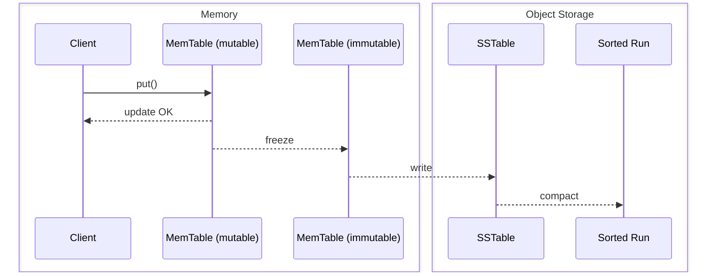
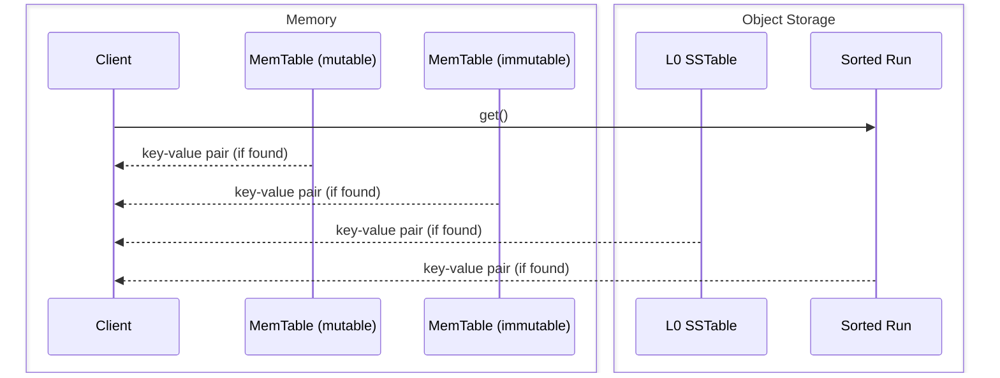

# SlateDB Notes

Source: https://materializedview.io/p/cloud-storage-triad-latency-cost-durability

## Thesis

Object stores are converging on low latency reads and writes with atomicity.

PUTs cost $0.005 per 1k requests.
At 10k requests/second, that is ~$130k/month.
Batching writes to every 10ms caps at 100 requests/second, dropping cost to ~$1,300/month.
This creates a three-way trade-off between cost, latency, and durability.
Think CAP for object store writes: cost/latency/durability ([source](https://x.com/criccomini/status/1781356213764321768)).

|               | cost | latency | durability |
|---------------|------|---------|------------|
| sync          | HIGH | HIGH    | HIGH       |
| sync batch    | HIGH | LOW     | HIGH       |
| async batch   | LOW  | LOW     | LOW        |

Reduce API costs by batching.
Clients can wait (durability) or not (latency).

SlateDB addresses this by writing everything (including the WAL) to object storage while caching recent writes in memory.

## API

- `put(key, value)` -- insert a key-value pair
- `get(key)` -- retrieve a key-value pair
- `delete(key)` -- delete a key-value pair
- `scan(range)` -- scan a range of keys
- `flush()` -- flush in-memory data to object storage

Keys are limited to 65 KiB.
Values are limited to 4 GiB.

## Core Components

- **Write-ahead log (WAL)** -- append-only persistent log
- **MemTables** -- sorted in-memory map; mutable one receives writes, immutable one is flushed in the background
- **SSTables** -- sorted on-disk (object storage) map
- **Compaction** -- merging multiple SSTables into range-partitioned sorted runs
- **Manifest** -- durable metadata tracking all SSTs and sorted runs

## Storage Layout

SlateDB's object store directory contains three directories: `manifest`, `wal`, and `compacted`.

```
path/to/db/
├─ manifest/
│  ├─ 00000000000000000001.manifest     // <manifest_id>.manifest
│  ├─ 00000000000000000002.manifest
│  └─ ...
├─ wal/
│  ├─ 00000000000000000001.sst          // <wal_id>.sst
│  ├─ 00000000000000000002.sst
│  └─ ...
└─ compacted/
   ├─ 01K3XYV1W2WR4FDVB7A9S319YS.sst    // <ulid>.sst
   ├─ 01K3XYV9JFPSZ5BW3Y1DVMKDFS.sst
   └─ ...
```

**Manifest** -- each file is a complete FlatBuffer-encoded snapshot of the database state: writer info, compactor info, and snapshots.
`writer_epoch` (monotonic `u64`) is incremented on writer startup; on increment, the writer fences older clients by writing an empty SST with the new epoch. Any writer with a lower epoch is a zombie ([writer protocol](https://slatedb.io/rfcs/0001-manifest/#writer-protocol)).
`compactor_epoch` works the same way for the compactor.
Snapshots are pointers to previous `.manifest` files, established by readers on startup ([read protocol](https://slatedb.io/rfcs/0001-manifest/#reader-protocol)). They prevent compaction from deleting in-use SSTs and give multiple clients a consistent view.

IDs are monotonically increasing and contiguous; the highest ID is the current manifest.
A single writer, multiple readers, and a single compactor can access it.
Updates are read-modify-write via CAS on the next manifest slot.

Size estimate (bytes):
```
  2                         // manifest_format_version
+ 8                         // writer_epoch
+ 8                         // compactor_epoch
+ 8                         // wal_id_last_compacted
+ 8                         // wal_id_last_seen
+ 4 + ~56 * leveled_ssts    // array length + ~56 bytes per SST
+ 4 + 28 * snapshots        // array length + 28 bytes per snapshot 
```
Example: 1000 snapshots + 100k SSTs = ~5.6 MiB.
At 100 MB/s S3 throughput, that is ~56ms read + ~56ms write + overhead, so roughly 250-500ms round-trip.

**WAL** -- a sequentially ordered, contiguous list of SSTs storing writes not yet compacted.
Unlike other LSMs, both WAL and compacted files use the SST format because SlateDB batches `put(k,v)` calls.

**Compacted** -- contains both L0 (non-partitioned) SSTables and sorted runs (partitioned SSTables).
As the compactor runs, it drops compacted SSTables from the manifest; the files remain in the directory until garbage collection.

## Write Path

Writes go to the in-memory WAL and MemTable synchronously, then return immediately (non-durable by default).
Background flushers freeze and write the WAL and MemTable to object storage when full.
Use `await_durable` or `flush()` to block until durable.



## Read Path



Reads check the mutable MemTable, then the immutable MemTable, returning immediately on hit.
On miss, the engine concurrently creates iterators over all L0 SSTables and compacted sorted runs, using block indexes (binary search) to locate candidates.
All iterators are merged into one that respects sequence numbers and snapshot visibility, then the result is returned.
Block cache is populated asynchronously during reads.
WAL SSTs are not read during normal operations; they are only accessed during recovery.

## Compaction

The main writer compacts the WAL to L0 directly from the memtable rather than reading back the WAL first.
The compactor merges L0 and lower-level SSTs into sorted runs, reducing space amplification (removing old/deleted rows) and read amplification (fewer runs to search).

```
WAL (raw write-ahead log)
  ↓  writer compacts directly from memtable
L0 (unpartitioned SSTs — no key-range partitioning)
  ↓  compactor merges when #SSTs > l0_compaction_threshold
L1, L2, L3, … (Sorted Runs, key-range partitioned within each SR)
```

SlateDB uses size-tiered compaction, which organizes sorted runs (SRs) into logical levels based on size.
The key invariant: runs in level N are at most size S(N), where S grows exponentially (S(N) = base_size × threshold^N).
When too many runs accumulate at a level, they get merged into a single new run at the next level.
Multiple sorted runs can coexist at the same level — that is what distinguishes tiered from leveled compaction (leveled enforces one run per level, forcing more merging).
Each SR spans the full keyspace and is made up of an ordered series of SSTs, each containing a distinct subset of that keyspace.
SRs within a level are ordered by age.

Tiered has lower write amplification (roughly by a factor of T, the per-level run threshold).
Since SlateDB lives on object storage where network bandwidth — not disk — is the bottleneck, write amplification (= more network I/O) is a real concern.
The trade-off is more space and read amplification, both addressable: object storage is cheap so space amplification is tolerable, bloom filters dramatically reduce read amplification, and future work ("lazy leveling") can fix space amplification at the last level by keeping only a single SR there.

The compactor has four components: `Compactor` (event loop), `CompactorEventHandler` (reacts to manifest poll ticks, executor updates, and shutdown), `CompactionScheduler` (decides what to compact), and `CompactionExecutor` (sort-merges runs into a new run).
The scheduler is pluggable via `CompactionSchedulerSupplier`; the only current policy is size-tiered (`SizeTieredCompactionSchedulerSupplier`).
The executor is pluggable via `CompactionExecutor`; the only current implementation is `TokioCompactionExecutor`.

## Timestamps & Time-To-Live

A configuration defines a default TTL and each put can optionally specify a row-level TTL at insertion time. 
Every read checks row-level metadata and filters out expired records.

SST data format
```
// v0
|  u16    | var |    u32    |  var  |
|---------|-----|-----------|-------|
| key_len | key | value_len | value |
|---------|-----|-----------|-------|

// v1
|  u16    | var | var  |    u32    |  var  |
|---------|-----|------|-----------|-------|
| key_len | key | attr | value_len | value |
|---------|-----|------|-----------|-------|
```

In cases where both `Timestamp` and `TimeToLive` are enabled, the row will look like:
```
                |-------- attr --------------|
|  u16    | var |    byte  | i64 |    i64    |    u32    |  var  |
|---------|-----|----------------------------|-----------|-------|
| key_len | key | row_flag | ts  | expire_ts | value_len | value |
|---------|-----|----------|-----|-----------|-----------|-------|
```

SlateDB uses the system clock internally for TTL expiration. The clock returns the system time in milliseconds since the Unix epoch, and SlateDB enforces monotonicity by tracking the last tick and sleeping briefly if clock skew is detected.

SlateDB includes a TTL compaction filter that tombstones expired records.

## Checkpoints and Clones

A checkpoint is a consistent, durable view of the database at a point in time.
Consistent means it reflects all writes up to that point; durable means it survives process restarts.
Physically, a checkpoint is a version of SlateDB's manifest.
Checkpoints can be taken from the current manifest or from an existing checkpoint.
The checkpoint mechanism replaces the older snapshots field in the manifest file.

A writer establishes a checkpoint on startup by creating a new manifest with a new writer epoch and a checkpoint entry.
Whenever L0s or sorted runs change, the writer creates a new manifest with the old checkpoint entry replaced.

Readers are created via `DbReader::open`, which takes an optional checkpoint.
If provided, `DbReader` uses it directly without refreshing.
If omitted, `DbReader` establishes its own checkpoint against the latest manifest and periodically polls at `manifest_poll_interval` to re-establish it as needed.

A clone is a new database bootstrapped from a checkpoint of a parent database.
The clone copies the parent's manifest (L0s, sorted runs, WAL pointers) and records the parent in an `external_dbs` list.
That list entry includes `source_checkpoint_id` (the checkpoint used to fork) and `final_checkpoint_id` (a checkpoint the clone places on the parent to prevent the parent's GC from deleting SSTs the clone still references).

## Range Queries

A range query uses the latest checkpoint state to obtain references to memtables, SSTs, and sorted runs.
The result is a `DbIterator` that iterates records within the requested range.
Internally, a `MergeIterator` sorts and merges across `MemTableIterator`, `SstIterator` (L0), and `SortedRunIterator`.

By default, only committed records from memtables, L0, and sorted runs are included.
Under `uncommitted` isolation, unflushed WAL records are also used as a source.

## Merge Operator

A merge operator lets applications bypass the read-modify-write cycle by expressing updates as an associative function.
Instead of reading the current value, modifying it, and writing it back, the caller writes a delta (a merge operand) that gets combined with the existing value lazily -- at read time or during compaction.
Users provide their own `MergeOperator` implementation via `DbOptions`; without one, the database rejects merge operations.

There are three record types for a key: `Value`, `Tombstone`, and `Merge`.
Merge operands can be interleaved with values and tombstones in the write stream.
Both `Value` and `Tombstone` act as barriers: they clear any previous merge history for the same key, so merging only needs to scan backwards until it hits one.

```
key = "counter"

  put(key, 10)      →  Value(10)        ← barrier
  merge(key, +1)    →  Merge(+1)
  merge(key, +3)    →  Merge(+3)
  ─────────────────────────────────
  get(key)          →  merge(merge(10, +1), +3) = 14

  delete(key)       →  Tombstone         ← barrier
  merge(key, +5)    →  Merge(+5)
  ─────────────────────────────────
  get(key)          →  merge(default, +5) = 5
```

Without merge, a read returns the latest `Value` or `None` on `Tombstone`.
With merge, a read must scan backwards through merge operands until it hits a `Value` or `Tombstone`, then fold all collected operands left-to-right into the base value.

During compaction, entries are eagerly merged: consecutive merge operands are combined with their base value when possible, collapsing the chain into a single `Value`.
Compaction must preserve snapshot isolation, so merging stops at any snapshot barrier -- a point where some reader may still be observing the pre-merge state.

When merge operands carry different TTLs, the merge operation only combines values during reads; entries stay separate in storage so each can expire independently.
Unlike regular values that become tombstones on expiration, expired merge entries are simply dropped, enabling per-element expiration in collections.

## Errors

Public API errors should not expose internal implementation details (so internals can change freely), should be prescriptive (telling users what to do, e.g. whether to retry), should prefer coarse/broad types (only add a new type if users would handle it differently), and should use rich error messages for diagnostics (messages are not part of the public API and can change freely).

## Synchronous commit

The key semantics of Synchronous Commit in general:

A write is only considered committed once the WAL has been persisted to storage. 
Until then, the data remains invisible to readers.
If there is a permanent failure while persisting the WAL during a Synchronous Commit, the transaction rolls back. 
The database instance enters a fatal state and switches to read-only mode.
It's possible to have multiple levels of Synchronous Commit, or even disable it, allowing users to balance performance and durability requirements.
Synchronous and Unsynchronous Commits can be interleaved in different transactions. 
A transaction using Synchronous Commit can read writes from transactions that used Unsynchronous Commit. 
When a Synchronous Commit persists, it also persists any previous Unsynchronous Commit writes in the WAL.

SlateDB's case, on the write side, a new `SyncLevel` enum (Off, Local, Remote) replaces the current `DurabilityLevel` for writes. 
When sync is enabled, a write isn't considered committed until the WAL is persisted to the specified level. 
Commits are strictly ordered — even a `SyncLevel::Off` write must wait for preceding sync writes to commit first.

On the read side, reads default to seeing only "committed" data (regardless of persistence status). 
A `durability_filter` option lets users further restrict reads to only data persisted at a certain level. 
A `dirty`: true flag is available for cases where users want to read any persisted data regardless of commit status.

## Transaction

Transactions need conflict detection to enforce isolation.
The conflict check verifies that the read and write keys of the committing transaction do not overlap with the write keys of any transaction that committed after it started.

There are several approaches to conflict checking, each with different trade-offs:

| Approach                     | Isolation      | Memory | Spurious aborts             | Complexity |
|------------------------------|----------------|--------|-----------------------------|------------|
| MemTable scan (RocksDB)      | SI only        | Low    | High (MemTable rotation)    | Low        |
| Global Oracle (seq/timestamp) | SI + SSI       | Medium | Low                         | Medium     |
| Pessimistic locking          | Serializable   | Low    | None (waits instead)        | Medium     |
| Serialization graph (PG SSI) | Serializable   | Higher | Very low                    | High       |

SlateDB uses a global oracle based on sequence numbers.
Each transaction receives a start sequence number and a commit sequence number.
At commit time, the oracle checks the committing transaction against all transactions that committed in the interval between its start and commit.

```
txn1: [seq:97] <--- ---- ---> [seq:99]
txn2:     [seq:98]  <--- ---- ---- ---- ---- ---- ---> [seq:105]
txn3:                               [seq:102] <--- ---> [seq:104]
txn4:                           [seq:101] <--- ---- ---- ---- ---> [seq:106]
```

In this example, txn4 (start=101, commit=106) must check conflicts with txn2 (commit=105) and txn3 (commit=104), because both committed after txn4 started.
It does not check txn1 (commit=99) because txn1 committed before txn4 started.

This also determines when to garbage-collect entries from the `recent_committed_txns` deque: an entry can be removed once all running transactions have a start sequence number greater than the entry's commit sequence number.

Transactions and snapshots have a default expiration time; any that are not finished within that window are considered expired.
