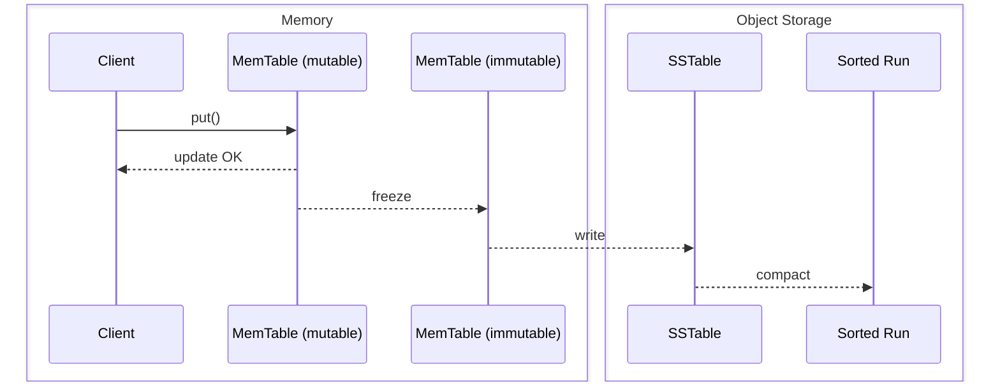
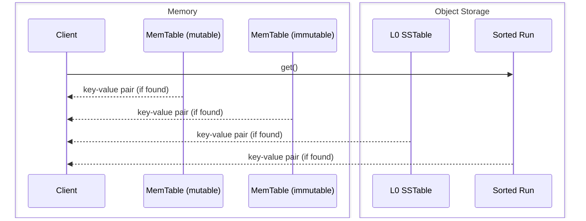

# SlateDB Notes

Source: https://materializedview.io/p/cloud-storage-triad-latency-cost-durability

## Thesis

Object stores are converging on low latency reads and writes with atomicity.

PUTs cost $0.005 per 1k requests.
At 10k requests/second, that is ~$130k/month.
Batching writes to every 10ms caps at 100 requests/second, dropping cost to ~$1,300/month.
This creates a three-way trade-off between cost, latency, and durability.
Think CAP for object store writes: cost/latency/durability ([source](https://x.com/criccomini/status/1781356213764321768)).

|               | cost | latency | durability |
|---------------|------|---------|------------|
| sync          | HIGH | HIGH    | HIGH       |
| sync batch    | HIGH | LOW     | HIGH       |
| async batch   | LOW  | LOW     | LOW        |

Reduce API costs by batching.
Clients can wait (durability) or not (latency).

SlateDB addresses this by writing everything (including the WAL) to object storage while caching recent writes in memory.

## API

- `put(key, value)` -- insert a key-value pair
- `get(key)` -- retrieve a key-value pair
- `delete(key)` -- delete a key-value pair
- `scan(range)` -- scan a range of keys
- `flush()` -- flush in-memory data to object storage

Keys are limited to 65 KiB.
Values are limited to 4 GiB.

## Core Components

- **Write-ahead log (WAL)** -- append-only persistent log
- **MemTables** -- sorted in-memory map; mutable one receives writes, immutable one is flushed in the background
- **SSTables** -- sorted on-disk (object storage) map
- **Compaction** -- merging multiple SSTables into range-partitioned sorted runs
- **Manifest** -- durable metadata tracking all SSTs and sorted runs

## Storage Layout

SlateDB's object store directory contains three directories: `manifest`, `wal`, and `compacted`.

```
path/to/db/
├─ manifest/
│  ├─ 00000000000000000001.manifest     // <manifest_id>.manifest
│  ├─ 00000000000000000002.manifest
│  └─ ...
├─ wal/
│  ├─ 00000000000000000001.sst          // <wal_id>.sst
│  ├─ 00000000000000000002.sst
│  └─ ...
└─ compacted/
   ├─ 01K3XYV1W2WR4FDVB7A9S319YS.sst    // <ulid>.sst
   ├─ 01K3XYV9JFPSZ5BW3Y1DVMKDFS.sst
   └─ ...
```

The manifest directory contains an ordered list of manifest files. 
Each manifest file is a complete snapshot of the database state at the time it was written. 
The name represents the manifest’s ID. Manifest IDs are monotonically increasing and contiguous. The manifest with the highest ID is considered the current manifest.
A manifest file can be updated by a single writer, multiple readers and a single compactor. 
All updates are done by (1) find largest manifest file (2) read that manifest (3) update it in memory (4) write the updated manifest to the next slot using compare-and-swap (CAS) operation. 
To prevent prevent zombie writers, it will use CAS to ensure each SST is written exactly one time – using writer epochs to determine when the current writer is a zombie and halt the process.
Each manifest is encoded as a FlatBuffer.
The size calculation (in bytes) for the manifest is:
```
  2                         // manifest_format_version
+ 8                         // writer_epoch
+ 8                         // compactor_epoch
+ 8                         // wal_id_last_compacted
+ 8                         // wal_id_last_seen
+ 4 + ~56 * leveled_ssts    // array length + leveled_ssts (~32 byte key + 24 bytes = ~56 bytes)
+ 4 + 28 * snapshots        // array length + snapshots (28 bytes each)
```
A manifest with 1000 snapshots and 100,000 compacted SSTs would be ~5.6 MiB. 
With 100MB/s to and from S3, it would take 56ms to read and 56ms to write (+overhead). All in, let’s say 250-500ms.

WAL is a sequentially ordered contiguous list of SSTs (both WAL and compacted files store SSTs, which differs from other LSMs because SlateDB's put(k,v) is batched).
The WAL is used to store writes that have not yet been compacted.

The compacted directory contains both L0 (non-partitioned) SSTables and SRs (partitioned SSTables). As the compactor runs, it will drop compacted SSTables from the manifest. Such files will be left in the compacted directory until the garbage collector runs.

## Write Path

Writes go to the in-memory WAL and MemTable synchronously, then return immediately (non-durable by default).
Background flushers freeze and write the WAL and MemTable to object storage when full.
Use `await_durable` or `flush()` to block until durable.



## Read Path



Reads check the mutable MemTable, then the immutable MemTable, returning immediately on hit.
On miss, the engine concurrently creates iterators over all L0 SSTables and compacted sorted runs, using block indexes (binary search) to locate candidates.
All iterators are merged into one that respects sequence numbers and snapshot visibility, then the result is returned.
Block cache is populated asynchronously during reads.
WAL SSTs are not read during normal operations; they are only accessed during recovery.

## Compaction

The compactor merges sorted runs (including L0 SSTs) to reduce space amplification (removing old/deleted rows) and read amplification (fewer runs to search).
It has four components: `Compactor` (event loop), `CompactorEventHandler` (reacts to manifest poll ticks, executor updates, and shutdown), `CompactionScheduler` (decides what to compact), and `CompactionExecutor` (sort-merges runs into a new run).
The scheduler is pluggable via `CompactionSchedulerSupplier`; the only current policy is size-tiered (`SizeTieredCompactionSchedulerSupplier`).
The executor is also pluggable via `CompactionExecutor`; the only current implementation is `TokioCompactionExecutor`.
