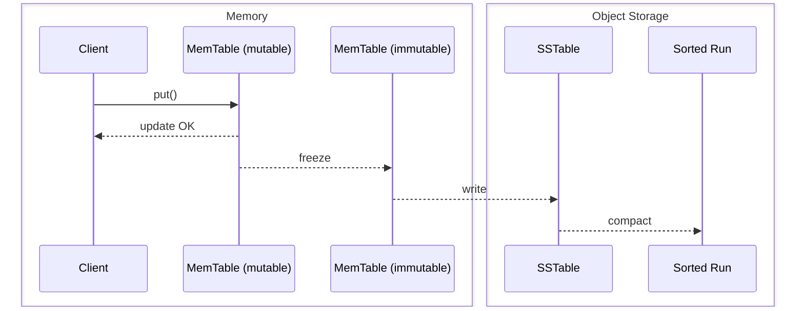
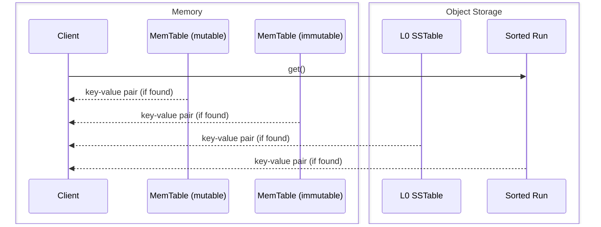

# SlateDB Notes

Source: https://materializedview.io/p/cloud-storage-triad-latency-cost-durability

## Thesis

Object stores are converging on low latency reads and writes with atomicity.

PUTs cost $0.005 per 1k requests.
At 10k requests/second, that is ~$130k/month.
Batching writes to every 10ms caps at 100 requests/second, dropping cost to ~$1,300/month.
This creates a three-way trade-off between cost, latency, and durability.

SlateDB addresses this by writing everything (including the WAL) to object storage while caching recent writes in memory.

## API

- `put(key, value)` -- insert a key-value pair
- `get(key)` -- retrieve a key-value pair
- `delete(key)` -- delete a key-value pair
- `scan(range)` -- scan a range of keys
- `flush()` -- flush in-memory data to object storage

Keys are limited to 65 KiB (65,535 bytes).
Values are limited to 4 GiB (4,294,967,295 bytes).

## Core Components

- **Write-ahead log (WAL)** -- append-only persistent log
- **MemTables** -- sorted in-memory map; mutable one receives writes, immutable one is flushed in the background
- **SSTables** -- sorted on-disk (object storage) map
- **Compaction** -- merging multiple SSTables into range-partitioned sorted runs
- **Manifest** -- durable metadata tracking all SSTs and sorted runs

## Storage Layout

SlateDB's object store directory contains three directories: `manifest`, `wal`, and `compacted`.

```
path/to/db/
├─ manifest/
│  ├─ 00000000000000000001.manifest     // <manifest_id>.manifest
│  ├─ 00000000000000000002.manifest
│  └─ ...
├─ wal/
│  ├─ 00000000000000000001.sst          // <wal_id>.sst
│  ├─ 00000000000000000002.sst
│  └─ ...
└─ compacted/
   ├─ 01K3XYV1W2WR4FDVB7A9S319YS.sst    // <ulid>.sst
   ├─ 01K3XYV9JFPSZ5BW3Y1DVMKDFS.sst
   └─ ...
```

## Write Path



Synchronous: write to in-memory WAL, then to in-memory MemTable.

Asynchronous: WAL is periodically flushed (in-memory WAL is frozen during flush).
MemTable is periodically flushed (in-memory MemTable is frozen during flush).

## Read Path



Lookup order: mutable MemTable, then immutable MemTable, then concurrent search across L0 SSTables and compacted sorted runs via block index.

## Compaction

TODO
