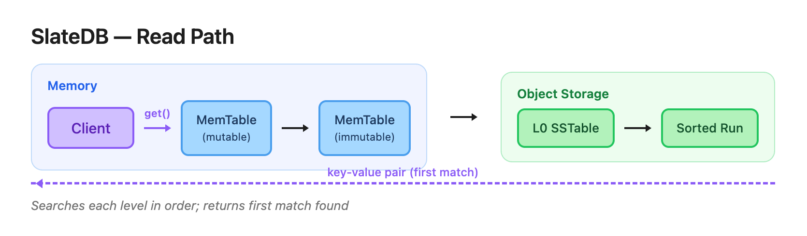
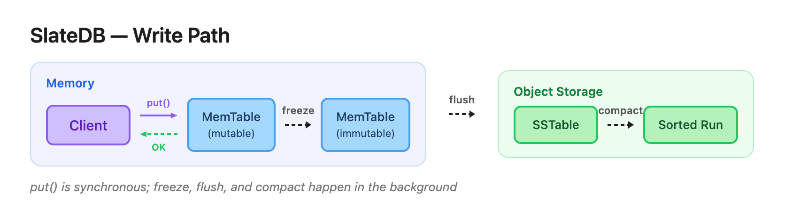

https://materializedview.io/p/cloud-storage-triad-latency-cost-durability

thesis is object stores to converge on low latency reads and writes with atomicity

PUTs are $0.005 per 1k requests (eg ~$130k per month for 10k requests a second service), there’s no choice but to batch writes. Limiting writes to every 10ms leads to max 100 request per second, which costs ~$1300.

This leads to cost, latency and durability trade off.
⬆️ cost ⬇️ latency ⬆️ durability = sync writes
⬇️ cost ⬆️ latency ⬆️ durability = sync batch writes
⬇️ cost ⬇️ latency ⬇️ durability = async batch writes

SlateDB, by contrast, writes everything (including the WAL) to object storage

SlateDB, by contrast, caches recent writes in memory

Keys are limited to a maximum of 65 KiB (65,535 bytes). Values are limited to a maximum of 4 GiB (4,294,967,295 bytes).

API
put(key, value): Insert a key-value pair. 
get(key): Retrieve a key-value pair.
delete(key): Delete a key-value pair.
scan(range): Scan a range of keys.
flush(): Flush the in-memory data to disk.

Write-ahead log (WAL) - an append-only persistent log
MemTables - a sorted in-memory map; mutable one receives writes while the froze MemTable is flushed in the background
SSTables - a sorted on-disk map;
Compaction - merging of multiple SSTables into a new sequence of range partitioned SSTables
Manifest - metadata

Trade offs






Files

SlateDB object store directory contains 3 main directories: manifest, wal and compacted.
```
path/to/db/
├─ manifest/
│  ├─ 00000000000000000001.manifest     // <manifest_id>.manifest
│  ├─ 00000000000000000002.manifest
│  └─ ...
├─ wal/
│  ├─ 00000000000000000001.sst          // <wal_id>.sst
│  ├─ 00000000000000000002.sst
│  └─ ...
└─ compacted/
   ├─ 01K3XYV1W2WR4FDVB7A9S319YS.sst    // <ulid>.sst
   ├─ 01K3XYV9JFPSZ5BW3Y1DVMKDFS.sst
   └─ ...
```

Writes (put(), write(), or delete())

sync part: write to in-memory WAL and then to in-memory MemTable.
async part: WAL is periodically flushed; during this process, in-memory WAL is frozen. MemTable is periodically flushed; during this process, in-memory MemTable is frozed.

Reads (get(), scan(), or similar)
  
checks in-memory mutable MemTable, then immutable one; then concurrently searches L0 SSTables and all compacted sorted runs through their block index
