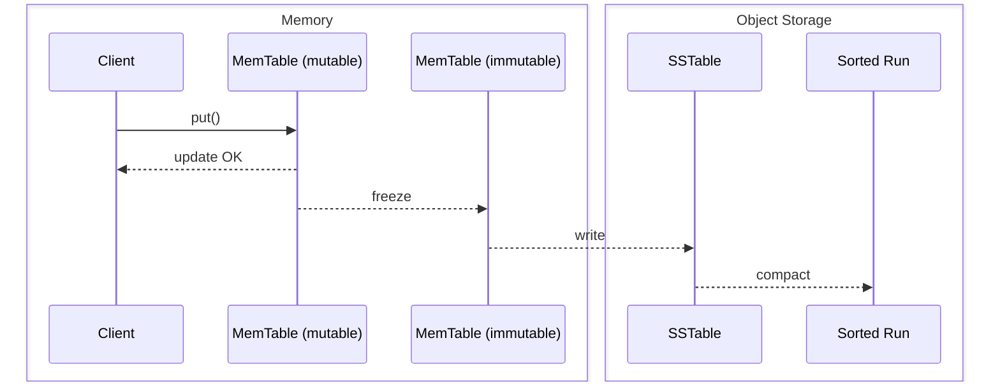
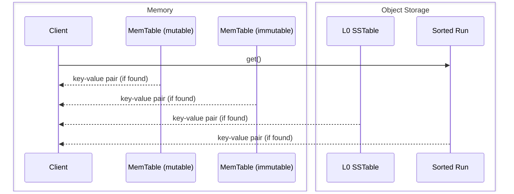

# SlateDB Notes

Source: https://materializedview.io/p/cloud-storage-triad-latency-cost-durability

## Thesis

Object stores are converging on low latency reads and writes with atomicity.

PUTs cost $0.005 per 1k requests.
At 10k requests/second, that is ~$130k/month.
Batching writes to every 10ms caps at 100 requests/second, dropping cost to ~$1,300/month.
This creates a three-way trade-off between cost, latency, and durability.
Think CAP for object store writes: cost/latency/durability ([source](https://x.com/criccomini/status/1781356213764321768)).

|               | cost | latency | durability |
|---------------|------|---------|------------|
| sync          | HIGH | HIGH    | HIGH       |
| sync batch    | HIGH | LOW     | HIGH       |
| async batch   | LOW  | LOW     | LOW        |

Reduce API costs by batching.
Clients can wait (durability) or not (latency).

SlateDB addresses this by writing everything (including the WAL) to object storage while caching recent writes in memory.

## API

- `put(key, value)` -- insert a key-value pair
- `get(key)` -- retrieve a key-value pair
- `delete(key)` -- delete a key-value pair
- `scan(range)` -- scan a range of keys
- `flush()` -- flush in-memory data to object storage

Keys are limited to 65 KiB.
Values are limited to 4 GiB.

## Core Components

- **Write-ahead log (WAL)** -- append-only persistent log
- **MemTables** -- sorted in-memory map; mutable one receives writes, immutable one is flushed in the background
- **SSTables** -- sorted on-disk (object storage) map
- **Compaction** -- merging multiple SSTables into range-partitioned sorted runs
- **Manifest** -- durable metadata tracking all SSTs and sorted runs

## Storage Layout

SlateDB's object store directory contains three directories: `manifest`, `wal`, and `compacted`.

```
path/to/db/
├─ manifest/
│  ├─ 00000000000000000001.manifest     // <manifest_id>.manifest
│  ├─ 00000000000000000002.manifest
│  └─ ...
├─ wal/
│  ├─ 00000000000000000001.sst          // <wal_id>.sst
│  ├─ 00000000000000000002.sst
│  └─ ...
└─ compacted/
   ├─ 01K3XYV1W2WR4FDVB7A9S319YS.sst    // <ulid>.sst
   ├─ 01K3XYV9JFPSZ5BW3Y1DVMKDFS.sst
   └─ ...
```

**Manifest** -- each file is a complete FlatBuffer-encoded snapshot of the database state: writer info, compactor info, and snapshots.
`writer_epoch` (monotonic `u64`) is incremented on writer startup; on increment, the writer fences older clients by writing an empty SST with the new epoch. Any writer with a lower epoch is a zombie ([writer protocol](https://slatedb.io/rfcs/0001-manifest/#writer-protocol)).
`compactor_epoch` works the same way for the compactor.
Snapshots are pointers to previous `.manifest` files, established by readers on startup ([read protocol](https://slatedb.io/rfcs/0001-manifest/#reader-protocol)). They prevent compaction from deleting in-use SSTs and give multiple clients a consistent view.

IDs are monotonically increasing and contiguous; the highest ID is the current manifest.
A single writer, multiple readers, and a single compactor can access it.
Updates are read-modify-write via CAS on the next manifest slot.

Size estimate (bytes):
```
  2                         // manifest_format_version
+ 8                         // writer_epoch
+ 8                         // compactor_epoch
+ 8                         // wal_id_last_compacted
+ 8                         // wal_id_last_seen
+ 4 + ~56 * leveled_ssts    // array length + ~56 bytes per SST
+ 4 + 28 * snapshots        // array length + 28 bytes per snapshot 
```
Example: 1000 snapshots + 100k SSTs = ~5.6 MiB.
At 100 MB/s S3 throughput, that is ~56ms read + ~56ms write + overhead, so roughly 250-500ms round-trip.

**WAL** -- a sequentially ordered, contiguous list of SSTs storing writes not yet compacted.
Unlike other LSMs, both WAL and compacted files use the SST format because SlateDB batches `put(k,v)` calls.

**Compacted** -- contains both L0 (non-partitioned) SSTables and sorted runs (partitioned SSTables).
As the compactor runs, it drops compacted SSTables from the manifest; the files remain in the directory until garbage collection.

## Write Path

Writes go to the in-memory WAL and MemTable synchronously, then return immediately (non-durable by default).
Background flushers freeze and write the WAL and MemTable to object storage when full.
Use `await_durable` or `flush()` to block until durable.



## Read Path



Reads check the mutable MemTable, then the immutable MemTable, returning immediately on hit.
On miss, the engine concurrently creates iterators over all L0 SSTables and compacted sorted runs, using block indexes (binary search) to locate candidates.
All iterators are merged into one that respects sequence numbers and snapshot visibility, then the result is returned.
Block cache is populated asynchronously during reads.
WAL SSTs are not read during normal operations; they are only accessed during recovery.

## Compaction

The compactor merges sorted runs (including L0 SSTs) to reduce space amplification (removing old/deleted rows) and read amplification (fewer runs to search).
It has four components: `Compactor` (event loop), `CompactorEventHandler` (reacts to manifest poll ticks, executor updates, and shutdown), `CompactionScheduler` (decides what to compact), and `CompactionExecutor` (sort-merges runs into a new run).
The scheduler is pluggable via `CompactionSchedulerSupplier`; the only current policy is size-tiered (`SizeTieredCompactionSchedulerSupplier`).
The executor is also pluggable via `CompactionExecutor`; the only current implementation is `TokioCompactionExecutor`.
